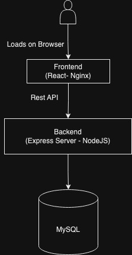

# Pre-Requisite 
1. Docker
2. Docker Compose

# How to Deploy Application
1. Run `docker compose up`
   
# Project Structure
```
📦 Root
├─ Backend
├─ Fronten
├─ mysql
├─ docker-compose.yml
└─ README.md
```

# Tech Stack
1. Backend
   1. NodeJS
   2. Express
   3. MySQL
   4. Passport
2. Frontend
   1. React
   2. GridStack
3. Container
   1. Docker
   2. Docker Compose

# High Level Architecture

